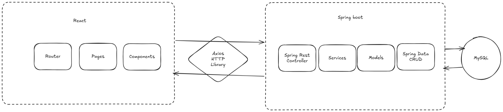

# Dokumentation

**Titel**: StorageUnitSystem  
**Autor**: Remo Wettstein  
**Datum**: 17.07.2025

---

## Inhaltsverzeichnis

- [Projektidee](#projektidee)
- [Anforderungskatalog](#anforderungskatalg)
  - [Funtionale Anwendungen](#funktionale-anforderungen)
  - [UI/UX Anforderungen](#uiux-anforderungen)
  - [Nicht Funktionale Anwendungen](#nicht-funktionale-anforderungen)
- [User-Stories](#user-stories)
- [Diagramme](#diagramme)
  - [Klassendiagramm](#klasendiagramm)
  - [Entity-Relationship-Diagramm (ERD)](#entity-relationship-diagramm-erd)
  - [Komponentendiagramm](#komponentendiagramm)
- [Storyboard](#storyboard)
- [Screen-Mockups](#screen-mockups)
- [REST-Schnitstellen](#rest-schnittstellen)
- [Testen](#testen)
  - [Testplan](#testplan)
  - [Testergebniss](#testergebnis)
- [Installationsanleitungen](#installationsanleitung)
  - [Frontend](#frontend)
  - [Backend](#backend)
- [Hilfestellungen](#hilfestellungen)

---

## Projektidee

Das Storage Unit System is eine Webanwendung, bei welche Nutzer Lagerräume (Units) bequem online von zuhause mieten und verwalten können.
Adminis können neue Lagerplätze anlegen, oder auch anpassen, als auch diese zu entfernen.
Zusätzlich können Nutzer die Units nach Preis, Verfügbarkeit, Grösse oder auch nach dem Namen sortieren.
Nach dem anlegen seienes Nutzeraccount, kann der User diverse Units mieten.

Der Fokus liegt auf einem klar gegliederten, einfach zu bedienenden User-Interface.

Die Applickation basiert technisch auf einem Backend mit SPRINGBOOT (REST-API), einer MySQL Datenbank und einem React-Frontend.

---

## Anforderungskatalg

Das Storage Unit System dient der Verwaltung von Lagerräumen und mietverhältnissen. Diese Anwendung ermöglicht Nutzern verfügbare Units leicht zu finden und diese anschliessend zu mieten.

---

### Funktionale Anforderungen

| NR. | Beschreibung       | Akzeptanzkriterien                                                        |
| --- | ------------------ | ------------------------------------------------------------------------- |
| F1  | Benutzer verwalten | Ein nutzer kann sich anlegen und anschliessend auch anpassungen vornehmen |
| F2  | Units anzeigen     | Die Units werden übersichtlicht angezeigt                                 |
| F3  | Units mieten       | Eine verfübare Unit kann gemieted werden                                  |
| F4  | Mieten einsehen    | Alle Mieten werden angezeigt                                              |
| F5  | Units verwalten    | Eine unit kann erstellt, angepasst oder gelöscht werden.                  |

---

### UI/UX Anforderungen

| NR. | Beschreibung                                            | Akzeptanzkriterien                                            |
| --- | ------------------------------------------------------- | ------------------------------------------------------------- |
| UX1 | Die Benutzeroberfäche is übersichtlich gestalted        | Der User findet sich schnell und gut zu recht                 |
| UX2 | Eine klare Navigation                                   | Der User finder sich zu recht                                 |
| UX3 | Die Fehlermeldungen und Validierungen sind Verständlich | Der User versteh, was von ihm verlangt wird.                  |
| UX4 | Formulare sind responsive und validiert                 | Die Website kann auf verschriedenen Geräten aufgerufen werden |
| UX5 | Nutzer sehen sofort ein Feedback nach einer Aktion      | Der User wird nach einer Aktion informiert                    |

---

### Nicht-Funktionale Anforderungen

| NR. | Beschreibung                                                                    | Akzeptanzkriterien                                          |
| --- | ------------------------------------------------------------------------------- | ----------------------------------------------------------- |
| NF1 | Die Anwendung verwendet eine relationale Datenbank                              | Verwendung von MySQL                                        |
| NF2 | REST-Schnitstellen folgen gängigen HTTP-Standards (GET;PUT;POST;DELETE)         | Für die API werden (GET;PUT;POST;DELETE) verwendet          |
| NF3 | Datenvalidierung erfolgt im Client als auch Serverseitig                        | Validierungen werden im Front als auch mit Backend erstellt |
| NF4 | Die Anwendung läuft zuverlässig under JAVA 17+ mit Springboot und Node.js React | Die anwendung wurde robust gestalted                        |

---

### User-Stories

:lemon: **User anlegen**
Als User möchte ich mich anlegen können um später dann auch mieten zu können

Akzeptanzkriterien:

- Das Passwort soll nicht leer sein.
- Der Benutzername muss vorhanden sein.
- Die Email Adresse muss gültig sein.

---

:watermelon: **Unit mieten**
Als Nutzer möchte ich Lagerräume mieten können, damit ich z.B meine nicht mehr verwendeten Möbel unterbringen kann.

Akzeptanzkriterien:

- Das Enddatum der neu Angelegten Miete darf nicht in der Vergangenheit liegen.
- Nach der Buchung eines Lagerraumes soll diese in der Datenbank abgespeichert werden.

---

:grapes: **Lagerflächen verwalten (Admin)**
Als Admin will ich neue Units anlegen können, damit Nutzer sie im Anschluss mieten können

Akzeptanzkriterien:

- Der Preis, Name und die Grösse müssen angegeben werden.
- Der Preis muss Positiv sein.
- Nach der Anlegung einer neuen Unit muss sie nun in der Datenbank erscheinen,

---

## Diagramme

### Klasendiagramm

Das [Klassendiagramm](./Pictures/storageUnitSytemServiceClassDiagramm.png) befindet sich im Ordner `Pictures`

---

### Entity-Relationship-Diagramm (ERD)

:santa: **Users**    
`id: Integer (PK)`    
`username: String`    
`email: String`    
`password: String (vorerst Leer)`    

---

💣 **StorageUnits**    
`id: Integer (PK)`    
`name: String („Unit69“)`    
`sizeInM2: Double (in m2)`    
`pricePerMonth: Double`    
`isAvailable: Boolean`    

---

:dollar: **Rented** (Verknüpfungstabelle für Buchungen)    
`id: Integer (PK)`    
`user_id: Integer (FK zu User)`    
`storage_unit_id: Integer (FK zu StorageUnit)`    
`startDate: LocalDate (Wann die Miete beginnt)`    
`endDate: LocalDate (Wann die Miete endet)`    


---

### Komponentendiagramm

Dieses Diagramm zeigt, wie meine Applikation aufgebaut ist.

- Im Frontend **React**
- Im Backend **Java (Spring)**
- Als DB **MySQL**

  - Zwischen dem Front und Backend **Axios**



---

## Storyboard

1. Nutzer gelangt auf die Homepage
2. Falls schon angelegt kann er direkt eine Unit mieten.
   - Falls nicht angelegt, auf der Userseite kann er dies tun.
3. Storage Unit ansehen.
4. Storage Unit auswählen.
5. Mietzeitraum festlegen.
6. Buchung abschliessen.

Im Bild unten ist das Storyboard mehr im Detail erklärt.


---

## Screen-Mockups

:gemini: **Homepage:**


:virgo: **Adminpage:**


:sagittarius: **Rentingpage:**


:pisces: **Userpage:**


---

## REST-Schnittstellen

### USERS:

 `/api/users`  
 `/api/users/{id}`  
 `/api/users`  
 `/api/users/{id}`  
 `/api/users/{id}`

**Datenmodell:**

```json
{
  "id": 1,
  "userName": "Alice",
  "email": "alice@example.com",
  "password": "password123"
}
```

### STORAGEUNITS:

 `/api/storageunits`  
 `/api/storageunits/{id}`  
 `/api/storageunits?sortBy={sortby}` (price, name, size, availability)  
 `/api/storageunits`  
 `/api/storageunits/{id}`  
 `/api/storageunits/{id}`

**Datenmodell:**

```json
{
  "id": 4,
  "name": "Unit D",
  "sizeInM2": 25.0,
  "pricePerMonth": 180.0,
  "available": true
}
```

### RENTINGS:

 `/api/rented`  
 `/api/rented/{id}`  
 `/api/rented/`  
 `/api/rented/{id}`  
 `/api/rented/{id}`

**Datenmodell:**

```json
{
  "id": 4,
  "startDate": "2025-02-01",
  "endDate": "2026-02-01",
  "user": {
    "id": 2,
    "userName": "Bob",
    "email": "bob@example.com",
    "password": "secret456"
  },
  "storageUnit": {
    "id": 4,
    "name": "Unit D",
    "sizeInM2": 25.0,
    "pricePerMonth": 180.0,
    "available": true
  }
}
```

## Testen

### Testplan

| Testfall | Beschreibung                     | Erwartetes Ergebnis                 |
| -------- | -------------------------------- | ----------------------------------- |
| 1        | Anmeldung ohne Passwort          | Validierungsfehler                  |
| 2        | Ungültige E-Mail-Adresse         | Validierungsfehler                  |
| 3        | Speichern einer Unit ohne Preis  | Validierungsfehler                  |
| 4        | Mietprozess mit gültigen Daten   | Mietobjekt wird korrekt gespeichert |
| 5        | Aufruf von GET /api/storageunits | Rückgabe einer Liste aller Units    |

### Testergebnis

- [x] Test 1: Fehler korrekt angezeigt bei leerem Passwort.
- [x] Test 2: Fehler bei ungültiger E-Mail getriggert.
- [x] Test 3: "Preis erforderlich" Meldung erscheint korrekt.
- [x] Test 4: Mietobjekt wurde erfolgreich in der Datenbank gespeichert.
- [x] Test 5: Liste der StorageUnits korrekt zurückgegeben.

## Installationsanleitung

Die Installationsanleitung finden sie in den einzelnen Repositorys im `INSTALLATION.md`.

### Frontend

Die anleitung befindet sich im Ordner `StorageUnitSystemClient`

[Frontend Installationsanleitung](./StorageUnitSystem-Client/INSTALLATION.md)

### Backend

Die anleitung befindet sich im Ordner `storageUnitSytemService`

[Frontend Installationsanleitung](./storageUnitSytemService/INSTALLATION.md)

## Hilfestellungen

- **ChatGPT (OpenAI)** ➔ Hilfestellung zu im Frontend
- **Stack Overflow** ➔ Fehler bei @DataJpaTest und SQL
- **Spring Boot Docs** ➔ Entity Mapping, Validation
- **DBeaver** ➔ ERD
- [Firma](https://Figma.com) ➔ Mockups
- [Excalidraw](https://excalidraw.com) ➔ Storyboard
- Noah Wieschmann und Silaz Enzler ➔ Feedback zu REST-API Design
- [Bezkoder](https://Bezkoder.com) ➔ Frontendhilfe
- [Notistack](https://notistack.com/getting-started) ➔ Anleiung wie man Notistack implementiert
- **IntelliJ** ➔ Klassendiagramm

## Fazit

Die umsetzung einer vollständigen Fullstack-Applickation war eine herausfordernde aber auch sehr lehrreiche Erfahrung. Von der Datenbankmodellierung, Containerisierung (Docker), das Design der Schnittstellen bis hin zu Gestaltung im Frontend, gab es in jeder Phase neue Hürden zu bewältigen. Besonder anspruchsvoll war es, den überblick über alle komponenten zu behalten und sicherzustellen, das diese miteinander kommunizieren können.

Während der Entwicklung wurde mir bewusst, dass man eine Anwendung theoretisch immer weiter verbessern und verfeinern kann. Irgendwann muss man sich jedoch zufrieden geben, da es sonst kein Ende findet.

In Zukunft werde ich mir auch mehr Zeit in der Vorarbeit, wie API gestalltung, Compoenten etc. in beanspruchung nehmen, da es mehr sinn macht all diese von anfang an zu designen.

Alles in allem war das Projekt sehr spannend und ich konnte viele wertvolle praktische Erfahrungen im bereich Fullstack-Webentwicklung sammeln. Dieses Wissen wird mir in zukünftigen Projekten bestimmt weiterhelfen.
